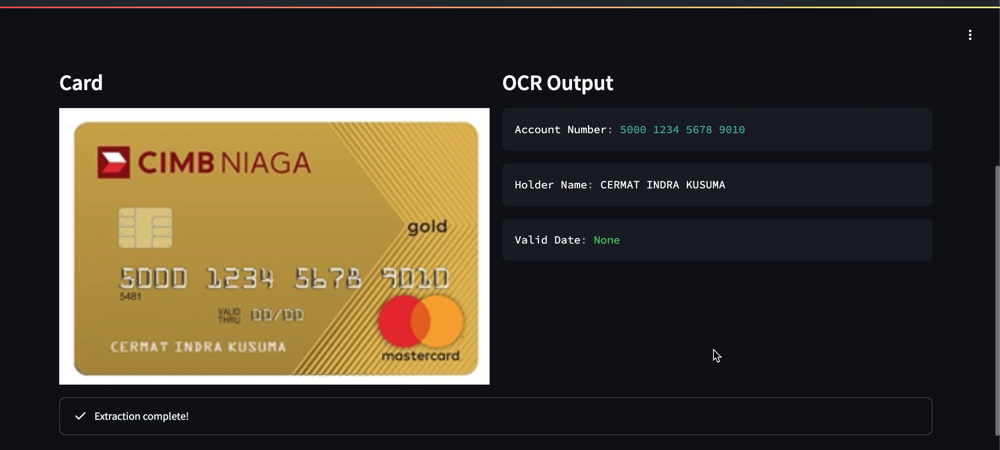
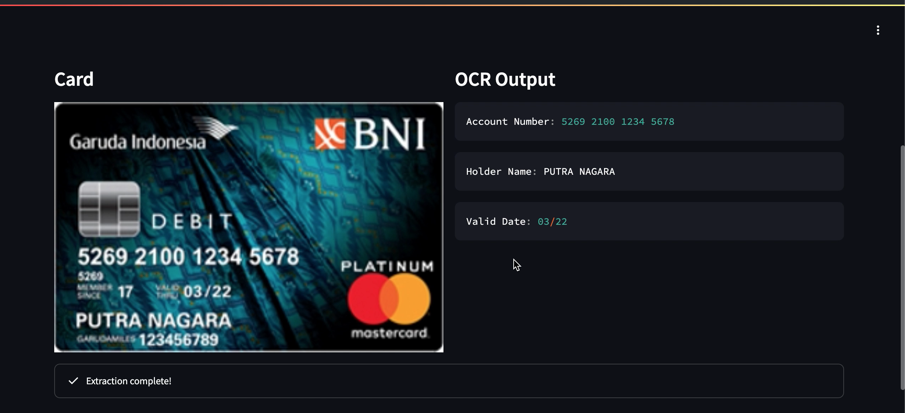

# CreditCardOCR 📇💳

CreditCardOCR is a powerful tool for extracting key details from credit or debit cards using the Florence2 Large model finetuned for this task. The model leverages state-of-the-art vision-language technology to accurately identify and extract details such as the account number, holder name, and valid date from images of cards. Post-processing is done using regular expressions to clean and extract the necessary details.

## Introduction 🚀

Extracting information from credit cards has never been easier! This project uses the Florence2 Large model, fine-tuned specifically for OCR tasks, combined with regular expressions for post-processing to ensure clean and accurate data extraction. Simply upload an image of a credit or debit card, and the tool will return the account number, holder name, and valid date.

### Basic Use Case

1. **Upload an Image**: Provide an image of a credit or debit card.
2. **Extract Information**: The model processes the image and extracts the account number, holder name, and valid date.
3. **Receive Results**: Get the extracted details quickly and efficiently.

## Real-Life Application 🌟

**Streamlined Checkout Process in E-commerce**:
CreditCardOCR can be integrated into e-commerce platforms to automate the entry of payment details. Customers can upload an image of their card during checkout, and the tool will automatically fill in their payment information. This enhances user experience, reduces errors, and increases conversion rates by providing a quick and hassle-free checkout process.

## Requirements 📦

To run this project, you will need the following dependencies:

```plaintext
transformers==4.42.3
pillow==10.3.0
requests-oauthlib==2.0.0
requests-toolbelt==0.10.1
numpy==1.25.2
aiosignal==1.3.1
aiosqlite==0.20.0
flash-attn==2.5.9.post1
googleapis-common-protos==1.63.1
pytest==7.2.0
pytest-asyncio==0.20.3
pytest-cov==4.0.0
regex==2024.5.15
fastapi==0.111.0
fastapi-cli==0.0.4
pydantic==1.10.16
json5==0.9.25
orjson==3.10.5
ujson==5.10.0
timm==1.0.7
einops==0.8.0
torch==2.2.0+cu121
torchvision==0.17.0+cu121
```

## How to Run 🏃‍♂️

1. First, run the FastAPI server:
   ```sh
   gunicorn -k uvicorn.workers.UvicornWorker app:app -w 2
   ```
2. Next, run the Streamlit UI:
   ```sh
   streamlit run ocr_ui.py
   ```

## Sample Images





## Usage 🛠️
Start the FastAPI server to handle OCR extraction requests.
Open the Streamlit UI to upload images and display the results.
By following these steps, you can easily set up and run the CreditCardOCR tool to extract important details from credit and debit cards.

## Contributing 🤝
We welcome contributions! If you have any ideas, suggestions, or improvements, feel free to open an issue or submit a pull request.

## Happy extracting! 🥳

